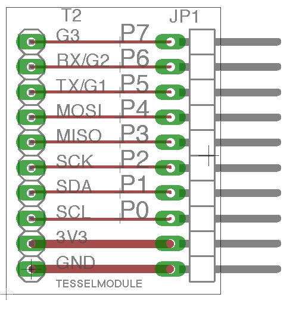
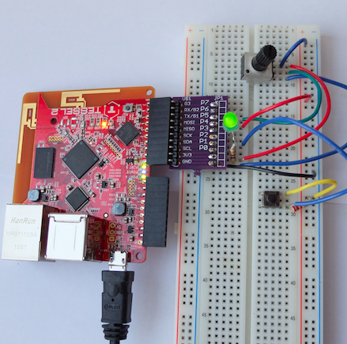

# Simple Eagle device for T2 modules

This is a simple T2 Eagle device to simplify the design of Tessel modules

As an example usage with a bread board see the image below:

# License

(c) 2016, patrick mulder, MIT license
